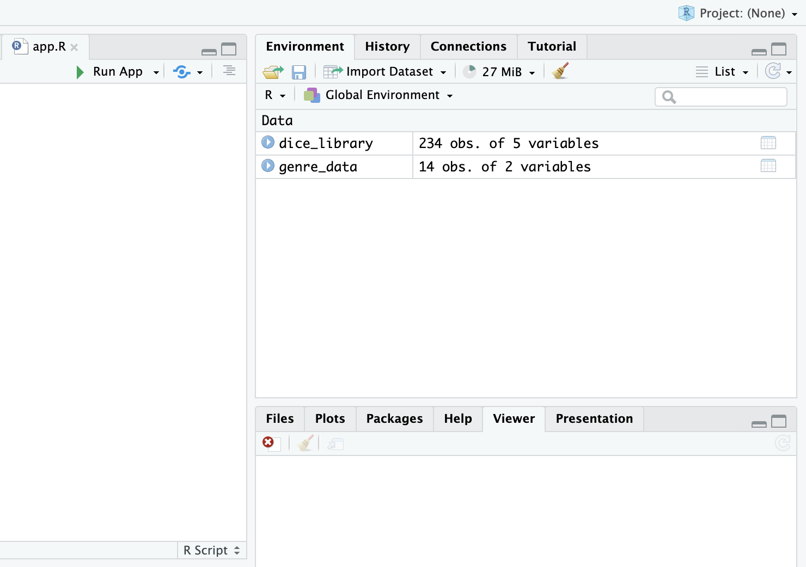
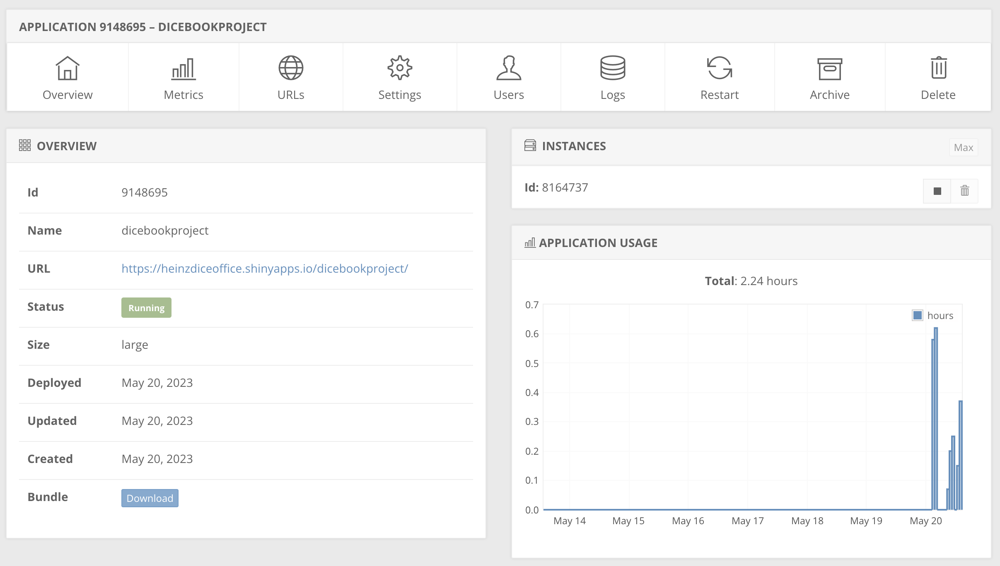

# DICE Book Project

The DICE Book Library project aims to provide easy access for Heinz students and staff to browse and register their interest in books available at the Office of DICE at Heinz.

## Dashboard Overview

The dashboard offers a user-friendly interface with three tabs. The 'About' tab provides giveaway information and project history. The 'Table' tab allows users to customize search inquiries, while the third tab displays a static genre distribution of available books. It ensures a seamless browsing experience for Heinz students and staff, facilitating easy access to the DICE Book Library project.

## Updating the Dashboard

**Accessing the Dashboard**

To update the dashboard, you must be working as a research assistant or a full-time professional at the DICE office. It is recommended to have one person in charge of the dashboard to streamline the process and avoid duplicating efforts.

To update the dashboard, follow these steps:

1. Open your R-studio and click on File > New File > Shiny Web App...
2. Provide an appropriate Application Name, such as "DICE Library."
3. Ensure that your directory is GIT-enabled to track any changes.
4. Optionally, you can add the existing directory to your GitHub Desktop and push all changes to your GitHub account.
5. Copy the code from [this GitHub repository](https://github.com/iambikashgupta/DICE-Book-Project/blob/master/app.R) and paste it in your app.R in thew new directory.
6. Save the required book data file (in CSV) and any other images from the GitHub repository in your new directory.
7. Contact Dr. Dareen Basma, the Associate Dean of Diversity at the DICE Office, to obtain the username and password for the website that will host the dashboard: [website link](https://www.shinyapps.io/). 
8. In the R-script section of the dashboard, located in the upper right portion, you will find an icon next to the run button. Use the dropdown menu and select "other destination" to connect to Shinyapps, where you will publish the dashboard.



**Updating the database**
1. The database can be updated using the [Google Sheet](https://docs.google.com/spreadsheets/d/1nkrPEsV_S3531LuuYnGHG2kYW7V5Mib2EY9H8KlooK0/edit#gid=567991390) accessible to DICE employees. 
2. In the Google Sheet, there are separate tabs for different genres. It is recommended to search for books by genre.
3. Download the file in .xlsx format.
4. After downloading, use the following Python code to convert the Excel file to CSV:

```python

import pandas as pd

# Replace 'filename.xlsx' with the name of your Excel file
excel_file = pd.read_excel('DICE_Library_Project.xlsx', sheet_name=None)

# Create an empty list to store the dataframes
dataframes = []

# Loop through each sheet in the Excel file and append it to the dataframes list
for genre, sheet in excel_file.items():
    # Add a new column to the sheet with the genre name
    sheet['Genre'] = genre
    dataframes.append(sheet)

# Concatenate all dataframes into one
combined_df = pd.concat(dataframes)

# Export the combined dataframe as a CSV file
combined_df.to_csv('combined.csv', index=False)

```
5. Replace 'combined.csv' in the code with the file name in your new directory. Run the app and publish it.

For beginners, it may take around 30 minutes to become familiar with the process. However, once you gain exposure, updating the dashboard should take no more than 15.

The shinyapps that will host the dashboard is useful and offers the important statistics on the application usages:




----
For any questions or inquiries, please feel free to contact me at bikash.gupta.srh@gmail.com 
